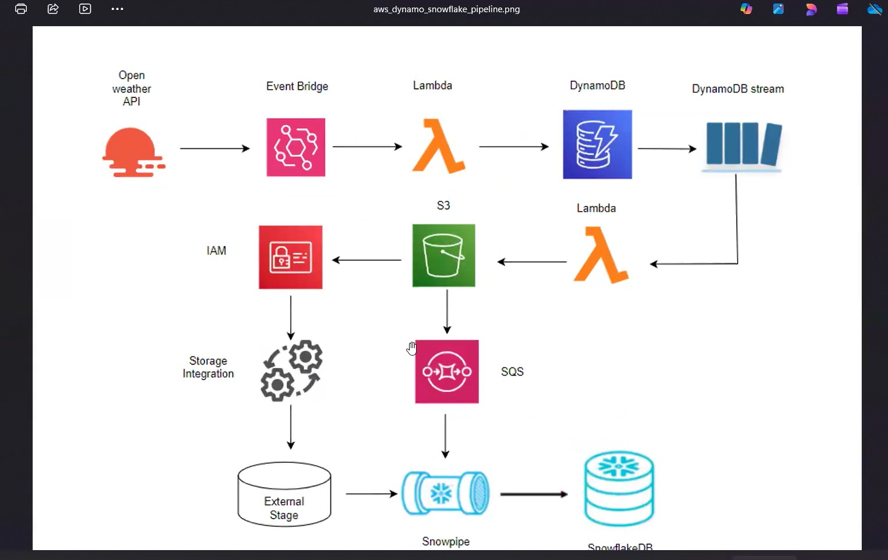

# Weather Data Pipeline

AWS Lambda + DynamoDB + S3 + Snowflake project.

## Architecture
The following diagram shows the complete workflow of the whether analytics pipeline.

EventBridge → Lambda → DynamoDB → DynamoDB Stream → Lambda → S3 → Snowflake

## Features

- Automated weather data collection
- EventBridge scheduled trigger
- DynamoDB storage
- DynamoDB Stream processing
- JSON files stored in S3
- Snowflake data loading

## Screenshots

Screenshots are available in the `screenshots/` folder.

## Future Improvements

- Add real Snowpipe auto-ingestion
- Build Streamlit dashboard
- Add data visualization